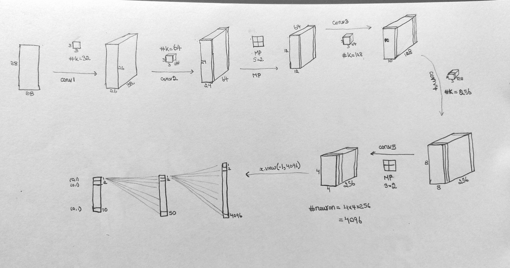

SESSION 5
===


## Objective

- Write Error prone Code in each block
- refactor/modularize code into model.py and utils.py


**S5 Folder Structure**
```
S5
├── Assignment
│   ├── model.py
│   ├── __pycache__
│   ├── README.md
│   ├── S5.ipynb
│   └── utils.py
├── pics
│   ├── memory_usage_Net_model.png
│   └── model_architecture.jpg
├── S5Notebook.ipynb
└── S5Notes.ipynb
```


Net Model Architecture.


<p>
    
</p>

RF and Params # Calculations

Formula
---


$$channel_{out}= {( channel_{in} + (2\times padding) - kernel)\over{stride}} +1 $$

$$j_{out} = j_{in}\times stride$$

$$ rf_{out} = rf_{in} + (kernel-1)\times j_{out}$$


RF calculation
---

let's Assume ```bias=False```
| **NAME** | channel_in  | channel_out | r_in | r_out | j_in | j_out | P | S | K | Param #              |
|----------|-------------|-------------|------|-------|------|-------|---|---|---|----------------------|
|  Conv1   |     28      |   26        | 1    | 3     | 1    | 1     | 0 | 1 | 3 | 3 * 3 * 32           |
|  Conv2   |    26       |   24        | 3    | 5     | 1    | 1     | 0 | 1 | 3 | (3 * 3 * 26) * 64    |
|  MaxPool |     24      |   12        | 5    | 6     | 1    | 2     | 0 | 2 | 2 |  Nil                 |
|  Conv3   |     12      |   10        | 6    |10     | 2    | 2     | 0 | 1 | 3 | (3 * 3 * 64) * 128   |
|  Conv4   |     10      |   8         |  10  | 14    | 2    | 2     | 0 | 1 | 3 | (3 * 3 * 128 ) * 256 |
|  Maxpool |      8      |   4         |  14  | 16    |  2   |  4    | 0 | 2 | 2 | Nil                  |


